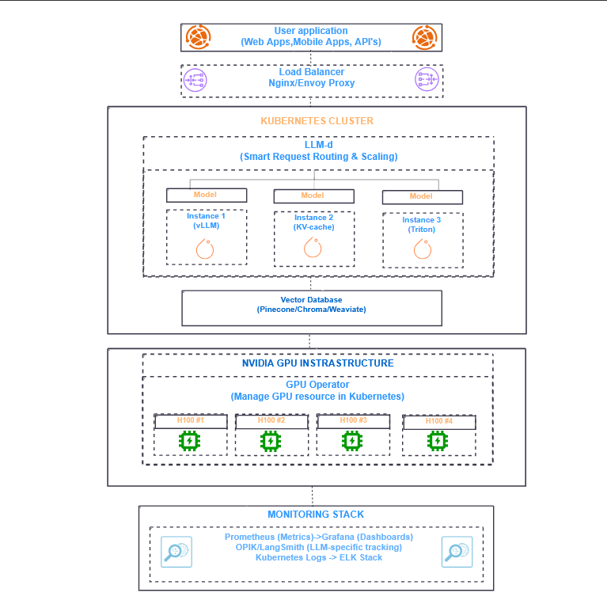

# Ai-infrastructure-production-deployment-
Building and documenting production-grade AI infrastructure that actually works.

# Start today with this
git init production-ai-infrastructure
cd production-ai-infrastructure

cat > README.md << 'EOF'
# Production AI Infrastructure: From Zero to Scale

## 🎯 Mission
Building and documenting production-grade AI infrastructure that actually works.

## 📈 Current Status
- ✅ Architecture designed
- ✅ Local environment setup
- 🔄 Building Kubernetes deployments
- ⏳ Implementing observability

## 🚀 Follow the Journey
- **LinkedIn**: [Daily updates]
- **Live System**: [Coming soon]
- **Discord**: [Community chat]

## 📊 Metrics
- Current throughput: 2,100 tokens/sec
- P50 latency: 89ms
- Cost per 1M tokens: $0.42

## 🛠 Tech Stack
[Your architecture diagram here]

## 📝 Latest Learning
[Date]: Discovered that KV cache sharing can reduce memory by 40%...

---
**Want to deploy LLMs at scale?** Let's connect!
EOF

git add .
git commit -m "init: Starting the journey to production AI infrastructure"
git push
